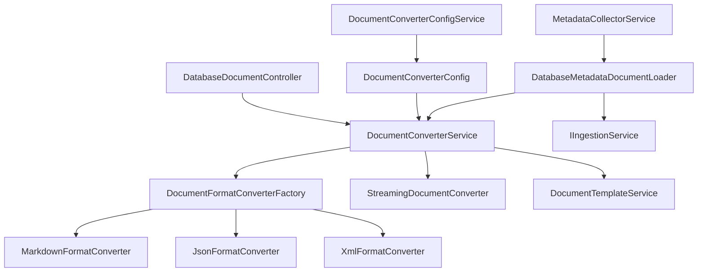

# Document Converter Module Design Documentation

## 1. 模块概述

### 1.1 模块目标
Document Converter Module 是 DBCrawlerV4 系统中负责将数据库元数据转换为结构化文档的核心模块。该模块的主要目标是：

- 将 DatabaseMetadata 对象转换为多种格式的结构化文档（Markdown、JSON、XML）
- 支持大数据场景下的流式处理和内存优化
- 提供灵活的分块策略和模板化文档生成
- 与现有的元数据收集和文档摄取流程无缝集成

### 1.2 核心功能
- **多格式转换**：支持 Markdown、JSON、XML 等多种输出格式
- **流式处理**：针对大型数据库的内存优化处理机制
- **模板化生成**：基于 FreeMarker 的可定制文档模板
- **分块策略**：多种数据分块策略以适应不同场景
- **异步处理**：支持异步转换以提升系统响应性
- **配置管理**：完整的配置体系和运行时参数调优

## 2. 架构设计

### 2.1 整体架构

```
┌─────────────────────────────────────────────────────────────┐
│                    Document Converter Module                │
├─────────────────────────────────────────────────────────────┤
│  Controller Layer                                           │
│  ┌─────────────────────────────────────────────────────────┐│
│  │           DatabaseDocumentController                    ││
│  └─────────────────────────────────────────────────────────┘│
├─────────────────────────────────────────────────────────────┤
│  Service Layer                                              │
│  ┌─────────────────┐ ┌─────────────────┐ ┌─────────────────┐│
│  │DocumentConverter│ │StreamingDocument│ │DocumentTemplate │││
│  │Service          │ │Converter        │ │Service          ││
│  └─────────────────┘ └─────────────────┘ └─────────────────┘│
├─────────────────────────────────────────────────────────────┤
│  Converter Implementation Layer                             │
│  ┌─────────────────┐ ┌─────────────────┐ ┌─────────────────┐│
│  │MarkdownFormat   │ │JsonFormat       │ │XmlFormat        ││
│  │Converter        │ │Converter        │ │Converter        ││
│  └─────────────────┘ └─────────────────┘ └─────────────────┘│
├─────────────────────────────────────────────────────────────┤
│  Factory & Configuration Layer                              │
│  ┌─────────────────┐ ┌─────────────────┐ ┌─────────────────┐│
│  │DocumentFormat   │ │DocumentConverter│ │DocumentConverter││
│  │ConverterFactory │ │Config           │ │ConfigService    ││
│  └─────────────────┘ └─────────────────┘ └─────────────────┘│
└─────────────────────────────────────────────────────────────┘
```

### 2.2 核心组件关系



## 3. 核心接口设计

### 3.1 DocumentConverterService 接口

```java
public interface DocumentConverterService {
    // 同步转换
    ConversionResult convert(DatabaseMetadata metadata, ConversionRequest request);
    
    // 异步转换
    CompletableFuture<ConversionResult> convertAsync(DatabaseMetadata metadata, ConversionRequest request);
    
    // 流式转换
    Stream<Document> convertStream(DatabaseMetadata metadata, ConversionRequest request);
    
    // 批量转换
    List<ConversionResult> convertBatch(List<DatabaseMetadata> metadataList, ConversionRequest request);
    
    // 支持的格式查询
    List<DocumentFormat> getSupportedFormats();
    boolean isFormatSupported(DocumentFormat format);
}
```

### 3.2 DocumentFormatConverter 接口

```java
public interface DocumentFormatConverter {
    // 获取支持的格式
    DocumentFormat getSupportedFormat();
    
    // 转换方法
    ConversionResult convert(DatabaseMetadata metadata, ConversionRequest request);
    
    // 优先级（用于处理格式冲突）
    default int getPriority() { return 0; }
}
```

### 3.3 StreamingDocumentConverter 接口

```java
public interface StreamingDocumentConverter {
    // 流式转换
    Stream<Document> convertStream(DatabaseMetadata metadata, StreamingConfig config);
    
    // 带处理器的流式转换
    <T> Stream<T> convertStreamWithProcessor(DatabaseMetadata metadata, 
                                           StreamingConfig config, 
                                           ChunkProcessor<T> processor);
    
    // 转换统计估算
    ConversionEstimate estimateConversion(DatabaseMetadata metadata, StreamingConfig config);
}
```

## 4. 数据模型设计

### 4.1 核心数据结构

#### ConversionRequest
```java
public record ConversionRequest(
    DocumentFormat format,
    ChunkingStrategy chunkingStrategy,
    List<String> includePatterns,
    List<String> excludePatterns,
    Map<String, Object> templateVariables,
    boolean includeMetadata,
    boolean includeStatistics
) {}
```

#### ConversionResult
```java
public record ConversionResult(
    List<Document> documents,
    ConversionStatistics statistics,
    List<ConversionError> errors,
    long processingTimeMs
) {}
```

#### StreamingConfig
```java
public record StreamingConfig(
    int chunkSize,
    int bufferSize,
    boolean parallelEnabled,
    ChunkingStrategy strategy
) {}
```

### 4.2 枚举类型

#### DocumentFormat
```java
public enum DocumentFormat {
    STRUCTURED_MARKDOWN("markdown", ".md"),
    STRUCTURED_JSON("json", ".json"),
    STRUCTURED_XML("xml", ".xml");
}
```

#### ChunkingStrategy
```java
public enum ChunkingStrategy {
    SINGLE_DOCUMENT,        // 所有内容生成单个文档
    CATALOG_PER_DOCUMENT,   // 每个 Catalog 生成一个文档
    SCHEMA_PER_DOCUMENT,    // 每个 Schema 生成一个文档
    TABLE_PER_DOCUMENT      // 每个 Table 生成一个文档
}
```

## 5. 实现细节

### 5.1 转换器实现

#### MarkdownFormatConverter
- **职责**：将 DatabaseMetadata 转换为 Markdown 格式文档
- **特性**：
  - 支持表格格式的列信息展示
  - 自动生成目录结构
  - 支持代码块语法高亮
  - 可配置的模板渲染

#### JsonFormatConverter
- **职责**：将 DatabaseMetadata 转换为 JSON 格式文档
- **特性**：
  - 结构化的 JSON 输出
  - 支持嵌套对象和数组
  - 类型安全的数据转换
  - 可配置的格式化选项

#### XmlFormatConverter
- **职责**：将 DatabaseMetadata 转换为 XML 格式文档
- **特性**：
  - 符合 XML 标准的输出
  - 支持命名空间和属性
  - 可配置的 XML Schema
  - 转义字符处理

### 5.2 流式处理机制

#### 内存优化策略
1. **分块处理**：将大型数据库按照配置的策略分块处理
2. **懒加载**：按需加载数据，避免一次性加载所有元数据
3. **流式输出**：使用 Java Stream API 实现流式处理
4. **缓冲控制**：可配置的缓冲区大小控制内存使用

#### 并行处理
1. **表级并行**：多个表的元数据可以并行处理
2. **分块并行**：不同的数据块可以并行转换
3. **线程池管理**：可配置的线程池大小
4. **背压控制**：防止生产者过快导致内存溢出

### 5.3 模板系统

#### FreeMarker 集成
- **模板位置**：`src/main/resources/templates/`
- **模板类型**：
  - `database-*.ftl`：数据库级别模板
  - `table-*.ftl`：表级别模板
  - `catalog-*.ftl`：目录级别模板

#### 模板变量
```java
// 数据库级别变量
Map<String, Object> databaseVariables = Map.of(
    "databaseName", metadata.getDatabaseName(),
    "databaseType", metadata.getDatabaseType(),
    "catalogs", metadata.getCatalogs(),
    "statistics", conversionStatistics,
    "generatedAt", Instant.now()
);

// 表级别变量
Map<String, Object> tableVariables = Map.of(
    "tableName", table.getName(),
    "schemaName", table.getSchemaName(),
    "columns", table.getColumns(),
    "indexes", table.getIndexes(),
    "foreignKeys", table.getForeignKeys()
);
```

## 6. 配置管理

### 6.1 配置文件结构

配置文件位于 `src/main/resources/application-converter.yml`：

```yaml
document:
  converter:
    default-format: STRUCTURED_MARKDOWN
    default-chunking-strategy: CATALOG_PER_DOCUMENT
    performance:
      streaming-threshold-tables: 1000
      streaming-threshold-memory: 100
      async-processing-enabled: true
      thread-pool-size: 4
      batch-size: 50
    templates:
      base-path: "classpath:templates/"
      mappings:
        STRUCTURED_MARKDOWN:
          database: "database-markdown.ftl"
          table: "table-markdown.ftl"
    streaming:
      enabled: true
      chunk-size: 100
      buffer-size: 1024
      parallel-enabled: true
    output:
      supported-formats:
        - STRUCTURED_MARKDOWN
        - STRUCTURED_JSON
        - STRUCTURED_XML
      include-metadata: true
      include-statistics: true
    filtering:
      enabled: true
      default-exclude-patterns:
        - "temp_*"
        - "*_backup"
        - "test_*"
```

### 6.2 配置验证

DocumentConverterConfigService 提供：
- **启动时验证**：应用启动时验证配置完整性
- **模板文件检查**：验证模板文件是否存在
- **运行时调优**：根据系统资源动态调整参数
- **配置热更新**：支持部分配置的运行时更新

## 7. 集成设计

### 7.1 与 MetadataCollectorService 集成

```java
// 通过 DatabaseMetadataDocumentLoader 桥接
@Service
public class DatabaseMetadataDocumentLoader implements DocumentLoader {
    
    @Autowired
    private MetadataCollectorService metadataCollectorService;
    
    @Autowired
    private DocumentConverterService documentConverterService;
    
    @Override
    public List<Document> load(String source) {
        // 1. 解析数据库连接信息
        DatabaseConnectionInfo connectionInfo = parseConnectionInfo(source);
        
        // 2. 收集数据库元数据
        DatabaseMetadata metadata = metadataCollectorService.collectMetadata(connectionInfo);
        
        // 3. 转换为文档
        ConversionResult result = documentConverterService.convert(metadata, conversionRequest);
        
        return result.documents();
    }
}
```

### 7.2 与 IngestionService 集成

```java
// 注册 DatabaseMetadataDocumentLoader
@Configuration
public class DocumentLoaderConfig {
    
    @Bean
    public DocumentLoader databaseMetadataDocumentLoader() {
        return new DatabaseMetadataDocumentLoader();
    }
}

// 使用示例
String databaseSource = "jdbc:mysql://localhost:3306/testdb?user=root&password=123456";
List<Document> documents = ingestionService.ingest(databaseSource);
```

### 7.3 REST API 集成

```java
@RestController
@RequestMapping("/api/database-documents")
public class DatabaseDocumentController {
    
    // 转换数据库元数据为文档
    @PostMapping("/convert")
    public ResponseEntity<ConversionResult> convertDatabase(@RequestBody ConversionRequest request);
    
    // 摄取数据库文档到知识库
    @PostMapping("/ingest")
    public ResponseEntity<IngestionResult> ingestDatabase(@RequestBody IngestionRequest request);
    
    // 流式转换大型数据库
    @PostMapping("/convert-stream")
    public ResponseEntity<StreamingResponse> convertDatabaseStream(@RequestBody StreamingRequest request);
}
```

## 8. 性能优化

### 8.1 内存管理
- **分块处理**：大型数据库按块处理，避免内存溢出
- **对象池**：重用转换过程中的临时对象
- **垃圾回收优化**：及时释放不再使用的对象引用
- **内存监控**：实时监控内存使用情况

### 8.2 处理速度优化
- **并行处理**：表级别和分块级别的并行处理
- **异步处理**：非阻塞的异步转换机制
- **缓存机制**：缓存模板编译结果和配置信息
- **批量操作**：批量处理多个转换请求

### 8.3 可扩展性设计
- **插件化架构**：新的格式转换器可以通过实现接口轻松添加
- **配置驱动**：大部分行为可以通过配置文件调整
- **模板系统**：支持自定义模板和样式
- **钩子机制**：提供转换前后的钩子函数

## 9. 错误处理和监控

### 9.1 错误处理策略
- **分级错误处理**：区分致命错误和可恢复错误
- **错误累积**：收集所有错误信息，不因单个错误停止处理
- **错误上下文**：提供详细的错误上下文信息
- **重试机制**：对于临时性错误提供重试机制

### 9.2 监控和日志
- **性能指标**：转换时间、内存使用、吞吐量等
- **业务指标**：转换成功率、错误率、文档数量等
- **详细日志**：记录转换过程的关键步骤
- **告警机制**：异常情况的及时告警

## 10. 测试策略

### 10.1 单元测试
- **转换器测试**：每个格式转换器的独立测试
- **配置测试**：配置加载和验证的测试
- **模板测试**：模板渲染功能的测试
- **工具类测试**：辅助工具类的测试

### 10.2 集成测试
- **端到端测试**：从数据库元数据到最终文档的完整流程测试
- **性能测试**：大数据量场景下的性能测试
- **并发测试**：多线程并发处理的测试
- **错误场景测试**：各种异常情况的处理测试

## 11. 部署和运维

### 11.1 部署要求
- **Java 版本**：JDK 17+
- **内存要求**：根据数据库大小调整，建议最小 2GB
- **磁盘空间**：临时文件和模板文件存储
- **网络要求**：访问目标数据库的网络连接

### 11.2 运维监控
- **健康检查**：提供健康检查端点
- **指标暴露**：通过 Actuator 暴露关键指标
- **日志管理**：结构化日志输出，便于日志分析
- **配置管理**：支持外部配置文件和环境变量

## 12. 未来扩展

### 12.1 功能扩展
- **更多格式支持**：PDF、Word、Excel 等格式
- **增量转换**：支持增量数据库变更的转换
- **版本控制**：文档版本管理和变更追踪
- **多语言支持**：国际化的文档生成

### 12.2 技术升级
- **响应式编程**：使用 WebFlux 实现响应式处理
- **云原生支持**：Kubernetes 部署和自动扩缩容
- **微服务拆分**：将转换功能独立为微服务
- **AI 增强**：使用 AI 技术优化文档生成质量

---

## 附录

### A. 文件清单

#### 核心接口和服务
- `DocumentConverterService.java` - 主服务接口
- `DocumentConverterServiceImpl.java` - 主服务实现
- `DocumentFormatConverter.java` - 格式转换器接口
- `StreamingDocumentConverter.java` - 流式转换器接口
- `StreamingDocumentConverterImpl.java` - 流式转换器实现

#### 格式转换器实现
- `MarkdownFormatConverter.java` - Markdown 格式转换器
- `JsonFormatConverter.java` - JSON 格式转换器
- `XmlFormatConverter.java` - XML 格式转换器

#### 工厂和配置
- `DocumentFormatConverterFactory.java` - 转换器工厂
- `DocumentConverterConfig.java` - 配置类
- `DocumentConverterConfigService.java` - 配置服务

#### 模板和集成
- `DocumentTemplateService.java` - 模板服务
- `DatabaseMetadataDocumentLoader.java` - 文档加载器
- `DatabaseDocumentController.java` - REST 控制器

#### 配置文件
- `application-converter.yml` - 配置文件

#### 模板文件
- `database-markdown.ftl` - 数据库 Markdown 模板
- `table-markdown.ftl` - 表 Markdown 模板
- `database-json.ftl` - 数据库 JSON 模板

### B. 依赖关系

```xml
<!-- FreeMarker 模板引擎 -->
<dependency>
    <groupId>org.freemarker</groupId>
    <artifactId>freemarker</artifactId>
</dependency>

<!-- Jackson JSON 处理 -->
<dependency>
    <groupId>com.fasterxml.jackson.core</groupId>
    <artifactId>jackson-databind</artifactId>
</dependency>

<!-- Spring Boot 配置处理 -->
<dependency>
    <groupId>org.springframework.boot</groupId>
    <artifactId>spring-boot-configuration-processor</artifactId>
</dependency>
```

### C. 使用示例

#### 基本使用
```java
// 创建转换请求
ConversionRequest request = new ConversionRequest(
    DocumentFormat.STRUCTURED_MARKDOWN,
    ChunkingStrategy.CATALOG_PER_DOCUMENT,
    List.of("user_*", "order_*"),  // 包含模式
    List.of("temp_*"),             // 排除模式
    Map.of("author", "System"),    // 模板变量
    true,                          // 包含元数据
    true                           // 包含统计信息
);

// 执行转换
ConversionResult result = documentConverterService.convert(metadata, request);

// 处理结果
for (Document document : result.documents()) {
    System.out.println("Generated document: " + document.getTitle());
    System.out.println("Content length: " + document.getContent().length());
}
```

#### 流式处理
```java
// 配置流式处理
StreamingConfig config = new StreamingConfig(50, 1024, true, ChunkingStrategy.TABLE_PER_DOCUMENT);

// 流式转换
Stream<Document> documentStream = streamingDocumentConverter.convertStream(metadata, config);

// 处理文档流
documentStream
    .filter(doc -> doc.getContent().length() > 100)
    .forEach(doc -> {
        // 处理每个文档
        ingestionService.ingest(doc);
    });
```

这份设计文档详细描述了 Document Converter Module 的完整设计和实现，为后续的维护和扩展提供了全面的参考。