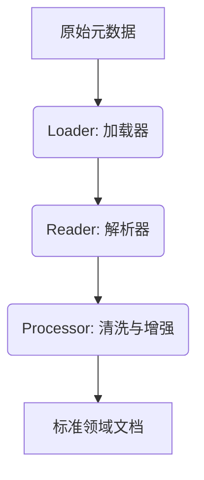

# 领域文档与数据清洗模块

## 1. 模块概述
本模块（`com.zwbd.dbcrawlerv4.document`）专注于将杂乱的技术元数据转化为AI可理解的“领域文档（Domain Document）”。通过内置的ETL流水线，实现数据加载、解析、清洗和语义增强。

## 2. 核心流程 (ETL Pipeline)

### 2.1 Loader (加载器)
位于 `document.etl.loader`。
*   负责从不同来源（数据库元数据、上传的文件、API响应）加载原始字节流或对象。

### 2.2 Reader (解析器)
位于 `document.etl.reader`。
*   **`MarkDownDocumentReader`**: 解析 Markdown 格式文档。
*   **`JsonDocumentReader`**: 解析 JSON 数据结构。
*   **`TikaDocumentReader`**: (基于Apache Tika) 处理 PDF, Word, Excel 等二进制文件。

### 2.3 Processor (清洗与增强)
位于 `document.etl.processor`。
*   **数据清洗**: 去除乱码、隐私脱敏（PII Removal）、空值处理。
*   **语义增强**: 利用 LLM 对字段名进行“业务翻译”（例如将 `col_001` 备注为 `用户年龄`）。
*   **分块策略**: 根据文档结构（Header/Paragraph）进行智能语义分块，而非简单的固定字符切分。

## 3. 领域文档定义
“领域文档”是本系统核心的数据资产单位。它不仅仅是文本，还包含：
*   **Content**: 经过清洗的文本内容。
*   **Metadata**: 
    *   `source`: 来源（某数据库、某文件）。
    *   `business_domain`: 所属业务域（通过多租户/Space隔离）。
    *   `last_updated`: 最后更新时间。

## 4. 扩展开发
若需支持新的文档类型（如 Notion 导出文件）：
1.  在 `document.etl.reader` 下实现新的 Reader 接口。
2.  在 `PipelineConfig` 中注册该 Reader。
