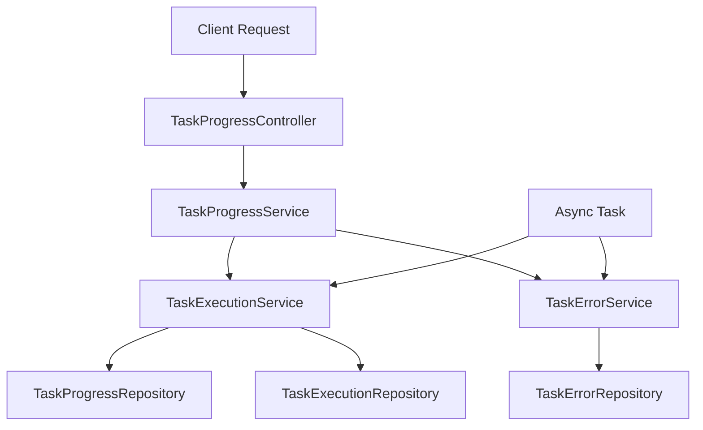

# Progress Monitor Module Design Document

## 1. 概述

### 1.1 模块目标
Progress Monitor Module 是一个精简的、模块化的进度监控系统，专门用于跟踪系统中长时间运行任务的执行状态。该模块支持异步任务处理、实时状态查询和错误信息记录。

### 1.2 设计原则
- **模块化设计**：独立的功能模块，与业务逻辑解耦
- **精简功能**：专注于进度监控和错误记录，避免功能膨胀
- **异步支持**：支持前端异步请求和后续状态查询
- **Spring集成**：与现有Spring Boot框架无缝集成
- **可扩展性**：支持不同类型任务的监控需求

### 1.3 适用场景
- 数据库元数据分析任务
- 文档转换处理任务
- 大数据量处理任务
- 其他需要进度跟踪的长时间运行任务

## 2. 架构设计

### 2.1 整体架构

```
┌─────────────────────────────────────────────────────────────┐
│                    Progress Monitor Module                   │
├─────────────────────────────────────────────────────────────┤
│  API Layer                                                  │
│  ┌─────────────────┐ ┌─────────────────┐ ┌─────────────────┐│
│  │ TaskProgress    │ │ TaskStatus      │ │ TaskError       ││
│  │ Controller      │ │ Controller      │ │ Controller      ││
│  └─────────────────┘ └─────────────────┘ └─────────────────┘│
├─────────────────────────────────────────────────────────────┤
│  Service Layer                                              │
│  ┌─────────────────┐ ┌─────────────────┐ ┌─────────────────┐│
│  │ TaskProgress    │ │ TaskExecution   │ │ TaskError       ││
│  │ Service         │ │ Service         │ │ Service         ││
│  └─────────────────┘ └─────────────────┘ └─────────────────┘│
├─────────────────────────────────────────────────────────────┤
│  Repository Layer                                           │
│  ┌─────────────────┐ ┌─────────────────┐ ┌─────────────────┐│
│  │ TaskProgress    │ │ TaskExecution   │ │ TaskError       ││
│  │ Repository      │ │ Repository      │ │ Repository      ││
│  └─────────────────┘ └─────────────────┘ └─────────────────┘│
├─────────────────────────────────────────────────────────────┤
│  Entity Layer                                               │
│  ┌─────────────────┐ ┌─────────────────┐ ┌─────────────────┐│
│  │ TaskProgress    │ │ TaskExecution   │ │ TaskError       ││
│  │ Entity          │ │ Entity          │ │ Entity          ││
│  └─────────────────┘ └─────────────────┘ └─────────────────┘│
└─────────────────────────────────────────────────────────────┘
```

### 2.2 核心组件关系



## 3. 核心接口设计

### 3.1 TaskProgressService 接口

```java
public interface TaskProgressService {
    
    /**
     * Start a new task and return task ID
     * @param taskType Task type identifier
     * @param taskName Human-readable task name
     * @param estimatedDuration Estimated duration in seconds
     * @return Task ID for tracking
     */
    String startTask(String taskType, String taskName, Long estimatedDuration);
    
    /**
     * Update task progress
     * @param taskId Task ID
     * @param currentStep Current step number
     * @param totalSteps Total number of steps
     * @param message Progress message
     */
    void updateProgress(String taskId, int currentStep, int totalSteps, String message);
    
    /**
     * Mark task as completed
     * @param taskId Task ID
     * @param result Task result data
     */
    void completeTask(String taskId, Object result);
    
    /**
     * Mark task as failed
     * @param taskId Task ID
     * @param error Error information
     */
    void failTask(String taskId, String error);
    
    /**
     * Get current task status
     * @param taskId Task ID
     * @return Task status information
     */
    TaskStatusDto getTaskStatus(String taskId);
    
    /**
     * Get task execution history
     * @param taskType Task type filter (optional)
     * @param limit Number of records to return
     * @return List of task executions
     */
    List<TaskExecutionDto> getTaskHistory(String taskType, int limit);
}
```

### 3.2 TaskExecutionService 接口

```java
public interface TaskExecutionService {
    
    /**
     * Execute task asynchronously with progress tracking
     * @param taskDefinition Task definition
     * @return CompletableFuture with task result
     */
    CompletableFuture<TaskResult> executeAsync(TaskDefinition taskDefinition);
    
    /**
     * Cancel running task
     * @param taskId Task ID
     * @return true if cancellation was successful
     */
    boolean cancelTask(String taskId);
    
    /**
     * Get all running tasks
     * @return List of currently running tasks
     */
    List<TaskExecutionDto> getRunningTasks();
}
```

### 3.3 TaskErrorService 接口

```java
public interface TaskErrorService {
    
    /**
     * Record task error
     * @param taskId Task ID
     * @param errorType Error type
     * @param errorMessage Error message
     * @param stackTrace Stack trace (optional)
     */
    void recordError(String taskId, String errorType, String errorMessage, String stackTrace);
    
    /**
     * Get errors for specific task
     * @param taskId Task ID
     * @return List of errors for the task
     */
    List<TaskErrorDto> getTaskErrors(String taskId);
    
    /**
     * Get recent errors across all tasks
     * @param limit Number of records to return
     * @return List of recent errors
     */
    List<TaskErrorDto> getRecentErrors(int limit);
}
```

## 4. 数据模型设计

### 4.1 核心实体

#### TaskProgress Entity
```java
@Entity
@Table(name = "task_progress")
public class TaskProgress {
    @Id
    private String taskId;
    
    private String taskType;
    private String taskName;
    private TaskStatus status;
    private int currentStep;
    private int totalSteps;
    private String currentMessage;
    private Long estimatedDuration;
    private LocalDateTime startTime;
    private LocalDateTime endTime;
    private String result;
    
    // getters and setters
}
```

#### TaskExecution Entity
```java
@Entity
@Table(name = "task_execution")
public class TaskExecution {
    @Id
    @GeneratedValue(strategy = GenerationType.UUID)
    private String executionId;
    
    private String taskId;
    private String taskType;
    private String taskName;
    private TaskStatus status;
    private LocalDateTime startTime;
    private LocalDateTime endTime;
    private Long duration;
    private String result;
    private String metadata;
    
    // getters and setters
}
```

#### TaskError Entity
```java
@Entity
@Table(name = "task_error")
public class TaskError {
    @Id
    @GeneratedValue(strategy = GenerationType.UUID)
    private String errorId;
    
    private String taskId;
    private String errorType;
    private String errorMessage;
    private String stackTrace;
    private LocalDateTime occurredAt;
    private String context;
    
    // getters and setters
}
```

### 4.2 枚举类型

#### TaskStatus
```java
public enum TaskStatus {
    PENDING,     // Task created but not started
    RUNNING,     // Task is currently executing
    COMPLETED,   // Task completed successfully
    FAILED,      // Task failed with error
    CANCELLED    // Task was cancelled
}
```

#### TaskType
```java
public enum TaskType {
    DATABASE_ANALYSIS("database_analysis", "Database Metadata Analysis"),
    DOCUMENT_CONVERSION("document_conversion", "Document Conversion"),
    DATA_PROCESSING("data_processing", "Data Processing"),
    CUSTOM("custom", "Custom Task");
    
    private final String code;
    private final String description;
    
    // constructor and getters
}
```

### 4.3 DTO 类

#### TaskStatusDto
```java
public record TaskStatusDto(
    String taskId,
    String taskType,
    String taskName,
    TaskStatus status,
    int currentStep,
    int totalSteps,
    String currentMessage,
    double progressPercentage,
    LocalDateTime startTime,
    LocalDateTime estimatedEndTime,
    Long elapsedSeconds,
    boolean hasErrors
) {}
```

#### TaskExecutionDto
```java
public record TaskExecutionDto(
    String executionId,
    String taskId,
    String taskType,
    String taskName,
    TaskStatus status,
    LocalDateTime startTime,
    LocalDateTime endTime,
    Long durationSeconds,
    String result,
    int errorCount
) {}
```

#### TaskErrorDto
```java
public record TaskErrorDto(
    String errorId,
    String taskId,
    String errorType,
    String errorMessage,
    LocalDateTime occurredAt,
    String context
) {}
```

## 5. REST API 设计

### 5.1 Task Progress API

```java
@RestController
@RequestMapping("/api/tasks")
public class TaskProgressController {
    
    // Start new task
    @PostMapping("/start")
    public ResponseEntity<TaskStartResponse> startTask(@RequestBody TaskStartRequest request);
    
    // Get task status
    @GetMapping("/{taskId}/status")
    public ResponseEntity<TaskStatusDto> getTaskStatus(@PathVariable String taskId);
    
    // Get task history
    @GetMapping("/history")
    public ResponseEntity<List<TaskExecutionDto>> getTaskHistory(
        @RequestParam(required = false) String taskType,
        @RequestParam(defaultValue = "20") int limit
    );
    
    // Cancel task
    @PostMapping("/{taskId}/cancel")
    public ResponseEntity<Void> cancelTask(@PathVariable String taskId);
    
    // Get running tasks
    @GetMapping("/running")
    public ResponseEntity<List<TaskExecutionDto>> getRunningTasks();
}
```

### 5.2 Task Error API

```java
@RestController
@RequestMapping("/api/tasks/{taskId}/errors")
public class TaskErrorController {
    
    // Get errors for specific task
    @GetMapping
    public ResponseEntity<List<TaskErrorDto>> getTaskErrors(@PathVariable String taskId);
    
    // Get recent errors across all tasks
    @GetMapping("/recent")
    public ResponseEntity<List<TaskErrorDto>> getRecentErrors(
        @RequestParam(defaultValue = "50") int limit
    );
}
```

## 6. 集成设计

### 6.1 与现有业务模块集成

#### DatabaseMetadata Analysis Integration
```java
@Service
public class DatabaseAnalysisTaskService {
    
    @Autowired
    private TaskProgressService taskProgressService;
    
    @Autowired
    private MetadataCollectorService metadataCollectorService;
    
    @Async
    public CompletableFuture<DatabaseMetadata> analyzeDatabase(DataBaseInfo dbInfo) {
        String taskId = taskProgressService.startTask(
            "database_analysis", 
            "Analyzing database: " + dbInfo.getHost(), 
            300L // 5 minutes estimated
        );
        
        try {
            taskProgressService.updateProgress(taskId, 1, 4, "Connecting to database");
            // Connect to database
            
            taskProgressService.updateProgress(taskId, 2, 4, "Collecting metadata");
            DatabaseMetadata metadata = metadataCollectorService.collectMetadata(dbInfo);
            
            taskProgressService.updateProgress(taskId, 3, 4, "Calculating metrics");
            // Calculate extended metrics
            
            taskProgressService.updateProgress(taskId, 4, 4, "Analysis completed");
            taskProgressService.completeTask(taskId, metadata);
            
            return CompletableFuture.completedFuture(metadata);
            
        } catch (Exception e) {
            taskProgressService.failTask(taskId, e.getMessage());
            throw new RuntimeException("Database analysis failed", e);
        }
    }
}
```

#### Document Conversion Integration
```java
@Service
public class DocumentConversionTaskService {
    
    @Autowired
    private TaskProgressService taskProgressService;
    
    @Autowired
    private DocumentConverterService documentConverterService;
    
    @Async
    public CompletableFuture<List<Document>> convertDocuments(DatabaseMetadata metadata) {
        String taskId = taskProgressService.startTask(
            "document_conversion", 
            "Converting database metadata to documents", 
            120L // 2 minutes estimated
        );
        
        try {
            taskProgressService.updateProgress(taskId, 1, 3, "Preparing conversion");
            
            taskProgressService.updateProgress(taskId, 2, 3, "Converting to documents");
            List<Document> documents = documentConverterService.convertToMarkdownDocuments(metadata);
            
            taskProgressService.updateProgress(taskId, 3, 3, "Conversion completed");
            taskProgressService.completeTask(taskId, documents);
            
            return CompletableFuture.completedFuture(documents);
            
        } catch (Exception e) {
            taskProgressService.failTask(taskId, e.getMessage());
            throw new RuntimeException("Document conversion failed", e);
        }
    }
}
```

### 6.2 前端集成示例

#### JavaScript Client
```javascript
class TaskProgressClient {
    
    async startTask(taskType, taskName, estimatedDuration) {
        const response = await fetch('/api/tasks/start', {
            method: 'POST',
            headers: { 'Content-Type': 'application/json' },
            body: JSON.stringify({ taskType, taskName, estimatedDuration })
        });
        return response.json();
    }
    
    async getTaskStatus(taskId) {
        const response = await fetch(`/api/tasks/${taskId}/status`);
        return response.json();
    }
    
    async pollTaskStatus(taskId, onUpdate, interval = 2000) {
        const poll = async () => {
            try {
                const status = await this.getTaskStatus(taskId);
                onUpdate(status);
                
                if (status.status === 'RUNNING' || status.status === 'PENDING') {
                    setTimeout(poll, interval);
                }
            } catch (error) {
                console.error('Failed to poll task status:', error);
            }
        };
        
        poll();
    }
}
```

## 7. 配置设计

### 7.1 Application Configuration

```yaml
# application-progress.yml
progress:
  monitor:
    enabled: true
    cleanup:
      # Clean up completed tasks older than 7 days
      completed-task-retention-days: 7
      # Clean up failed tasks older than 30 days
      failed-task-retention-days: 30
      # Run cleanup every 6 hours
      cleanup-interval-hours: 6
    async:
      # Thread pool for async task execution
      core-pool-size: 2
      max-pool-size: 10
      queue-capacity: 100
      thread-name-prefix: "task-exec-"
    polling:
      # Default polling interval for clients (milliseconds)
      default-interval-ms: 2000
      # Maximum polling interval (milliseconds)
      max-interval-ms: 30000
```

### 7.2 Database Configuration

```sql
-- Task Progress Tables
CREATE TABLE task_progress (
    task_id VARCHAR(36) PRIMARY KEY,
    task_type VARCHAR(50) NOT NULL,
    task_name VARCHAR(255) NOT NULL,
    status VARCHAR(20) NOT NULL,
    current_step INTEGER DEFAULT 0,
    total_steps INTEGER DEFAULT 0,
    current_message TEXT,
    estimated_duration BIGINT,
    start_time TIMESTAMP NOT NULL,
    end_time TIMESTAMP,
    result TEXT,
    created_at TIMESTAMP DEFAULT CURRENT_TIMESTAMP,
    updated_at TIMESTAMP DEFAULT CURRENT_TIMESTAMP
);

CREATE TABLE task_execution (
    execution_id VARCHAR(36) PRIMARY KEY,
    task_id VARCHAR(36) NOT NULL,
    task_type VARCHAR(50) NOT NULL,
    task_name VARCHAR(255) NOT NULL,
    status VARCHAR(20) NOT NULL,
    start_time TIMESTAMP NOT NULL,
    end_time TIMESTAMP,
    duration BIGINT,
    result TEXT,
    metadata JSONB,
    created_at TIMESTAMP DEFAULT CURRENT_TIMESTAMP
);

CREATE TABLE task_error (
    error_id VARCHAR(36) PRIMARY KEY,
    task_id VARCHAR(36) NOT NULL,
    error_type VARCHAR(100) NOT NULL,
    error_message TEXT NOT NULL,
    stack_trace TEXT,
    occurred_at TIMESTAMP NOT NULL,
    context TEXT,
    created_at TIMESTAMP DEFAULT CURRENT_TIMESTAMP
);

-- Indexes for performance
CREATE INDEX idx_task_progress_status ON task_progress(status);
CREATE INDEX idx_task_progress_type ON task_progress(task_type);
CREATE INDEX idx_task_execution_type_time ON task_execution(task_type, start_time);
CREATE INDEX idx_task_error_task_id ON task_error(task_id);
CREATE INDEX idx_task_error_occurred_at ON task_error(occurred_at);
```

## 8. 实现细节

### 8.1 异步任务执行

```java
@Configuration
@EnableAsync
public class AsyncConfig {
    
    @Bean(name = "taskExecutor")
    public TaskExecutor taskExecutor() {
        ThreadPoolTaskExecutor executor = new ThreadPoolTaskExecutor();
        executor.setCorePoolSize(2);
        executor.setMaxPoolSize(10);
        executor.setQueueCapacity(100);
        executor.setThreadNamePrefix("task-exec-");
        executor.initialize();
        return executor;
    }
}
```

### 8.2 进度更新机制

```java
@Component
public class ProgressTracker {
    
    private final TaskProgressService taskProgressService;
    
    public ProgressTracker(TaskProgressService taskProgressService) {
        this.taskProgressService = taskProgressService;
    }
    
    public void trackProgress(String taskId, Runnable task, int totalSteps) {
        AtomicInteger currentStep = new AtomicInteger(0);
        
        // Wrap task execution with progress tracking
        try {
            task.run();
        } catch (Exception e) {
            taskProgressService.failTask(taskId, e.getMessage());
            throw e;
        }
    }
    
    public void updateStep(String taskId, int step, String message) {
        taskProgressService.updateProgress(taskId, step, 0, message);
    }
}
```

### 8.3 错误处理策略

```java
@Component
public class TaskErrorHandler {
    
    private final TaskErrorService taskErrorService;
    
    public void handleTaskError(String taskId, Exception exception) {
        String errorType = exception.getClass().getSimpleName();
        String errorMessage = exception.getMessage();
        String stackTrace = getStackTrace(exception);
        
        taskErrorService.recordError(taskId, errorType, errorMessage, stackTrace);
    }
    
    private String getStackTrace(Exception e) {
        StringWriter sw = new StringWriter();
        PrintWriter pw = new PrintWriter(sw);
        e.printStackTrace(pw);
        return sw.toString();
    }
}
```

## 9. 监控和日志

### 9.1 性能监控

```java
@Component
public class TaskMetrics {
    
    private final MeterRegistry meterRegistry;
    
    public TaskMetrics(MeterRegistry meterRegistry) {
        this.meterRegistry = meterRegistry;
    }
    
    public void recordTaskDuration(String taskType, long durationMs) {
        Timer.Sample sample = Timer.start(meterRegistry);
        sample.stop(Timer.builder("task.duration")
                .tag("type", taskType)
                .register(meterRegistry));
    }
    
    public void incrementTaskCounter(String taskType, String status) {
        Counter.builder("task.count")
                .tag("type", taskType)
                .tag("status", status)
                .register(meterRegistry)
                .increment();
    }
}
```

### 9.2 日志配置

```java
@Slf4j
@Service
public class TaskProgressServiceImpl implements TaskProgressService {
    
    @Override
    public String startTask(String taskType, String taskName, Long estimatedDuration) {
        String taskId = UUID.randomUUID().toString();
        log.info("Starting task: {} [{}] with ID: {}", taskName, taskType, taskId);
        
        // Implementation
        
        return taskId;
    }
    
    @Override
    public void completeTask(String taskId, Object result) {
        log.info("Task completed successfully: {}", taskId);
        
        // Implementation
    }
    
    @Override
    public void failTask(String taskId, String error) {
        log.error("Task failed: {} - Error: {}", taskId, error);
        
        // Implementation
    }
}
```

## 10. 测试策略

### 10.1 单元测试

```java
@ExtendWith(MockitoExtension.class)
class TaskProgressServiceTest {
    
    @Mock
    private TaskProgressRepository taskProgressRepository;
    
    @InjectMocks
    private TaskProgressServiceImpl taskProgressService;
    
    @Test
    void shouldStartTaskSuccessfully() {
        // Given
        String taskType = "test_task";
        String taskName = "Test Task";
        Long estimatedDuration = 300L;
        
        // When
        String taskId = taskProgressService.startTask(taskType, taskName, estimatedDuration);
        
        // Then
        assertThat(taskId).isNotNull();
        verify(taskProgressRepository).save(any(TaskProgress.class));
    }
}
```

### 10.2 集成测试

```java
@SpringBootTest
@Transactional
class TaskProgressIntegrationTest {
    
    @Autowired
    private TaskProgressService taskProgressService;
    
    @Test
    void shouldTrackTaskProgressEndToEnd() {
        // Given
        String taskId = taskProgressService.startTask("integration_test", "Integration Test", 60L);
        
        // When
        taskProgressService.updateProgress(taskId, 1, 2, "Step 1");
        taskProgressService.updateProgress(taskId, 2, 2, "Step 2");
        taskProgressService.completeTask(taskId, "Success");
        
        // Then
        TaskStatusDto status = taskProgressService.getTaskStatus(taskId);
        assertThat(status.status()).isEqualTo(TaskStatus.COMPLETED);
        assertThat(status.currentStep()).isEqualTo(2);
        assertThat(status.totalSteps()).isEqualTo(2);
    }
}
```

## 11. 部署和运维

### 11.1 部署要求
- **Java 版本**：JDK 17+
- **数据库**：PostgreSQL 12+ (支持JSONB)
- **内存要求**：最小 1GB，推荐 2GB+
- **并发支持**：支持多线程异步任务执行

### 11.2 运维监控
- **健康检查**：提供 `/actuator/health` 端点
- **指标暴露**：通过 Micrometer 暴露任务执行指标
- **日志管理**：结构化日志输出，支持 ELK 集成
- **数据清理**：自动清理过期的任务记录

## 12. 未来扩展

### 12.1 功能扩展
- **任务依赖**：支持任务间的依赖关系
- **任务调度**：集成定时任务调度功能
- **通知机制**：任务完成/失败的邮件/短信通知
- **任务模板**：预定义的任务模板和配置

### 12.2 技术升级
- **WebSocket支持**：实时推送任务状态更新
- **分布式支持**：支持多实例部署的任务协调
- **缓存优化**：使用Redis缓存频繁查询的任务状态
- **消息队列**：使用RabbitMQ/Kafka处理大量任务

---

## 附录

### A. 文件清单

#### 核心服务类
- `TaskProgressService.java` - 进度跟踪服务接口
- `TaskProgressServiceImpl.java` - 进度跟踪服务实现
- `TaskExecutionService.java` - 任务执行服务接口
- `TaskExecutionServiceImpl.java` - 任务执行服务实现
- `TaskErrorService.java` - 错误记录服务接口
- `TaskErrorServiceImpl.java` - 错误记录服务实现

#### 控制器类
- `TaskProgressController.java` - 进度监控API控制器
- `TaskErrorController.java` - 错误信息API控制器

#### 实体类
- `TaskProgress.java` - 任务进度实体
- `TaskExecution.java` - 任务执行实体
- `TaskError.java` - 任务错误实体

#### 配置类
- `ProgressMonitorConfig.java` - 进度监控配置
- `AsyncConfig.java` - 异步执行配置

#### 工具类
- `ProgressTracker.java` - 进度跟踪工具
- `TaskErrorHandler.java` - 错误处理工具
- `TaskMetrics.java` - 指标收集工具

### B. 配置文件
- `application-progress.yml` - 进度监控配置
- `progress-monitor-ddl.sql` - 数据库表结构

### C. 使用示例

#### 基本使用
```java
// 启动任务
String taskId = taskProgressService.startTask("data_analysis", "Analyzing user data", 300L);

// 更新进度
taskProgressService.updateProgress(taskId, 1, 5, "Loading data");
taskProgressService.updateProgress(taskId, 2, 5, "Processing data");

// 完成任务
taskProgressService.completeTask(taskId, analysisResult);
```

#### 异步任务集成
```java
@Async
public CompletableFuture<String> processDataAsync(String dataSource) {
    String taskId = taskProgressService.startTask("data_processing", "Processing: " + dataSource, 180L);
    
    try {
        // 执行业务逻辑
        String result = processData(dataSource);
        taskProgressService.completeTask(taskId, result);
        return CompletableFuture.completedFuture(result);
    } catch (Exception e) {
        taskProgressService.failTask(taskId, e.getMessage());
        throw e;
    }
}
```

这份设计文档提供了Progress Monitor Module的完整设计和实现指南，确保模块的精简性、可扩展性和与现有系统的良好集成。