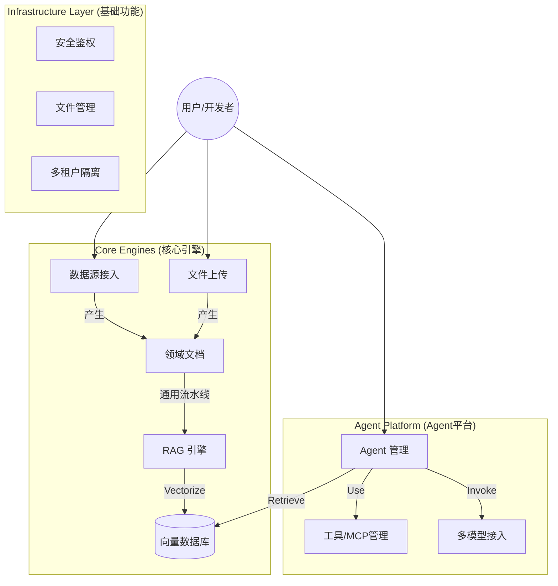

# AgentNexus - 企业级多Agent开发平台

> **定位**: 从智能数据库分析底座，进化为集数据集成、知识库构建、多Agent协同于一体的企业级开发平台。

## 1. 项目简介
DBCrawlerV4 最初设计为一个利用 AI 进行数据库元数据分析的工具（DBCrawler）。随着业务发展，现已重构为一个**多Agent开发平台**。它不仅能自动“理解”您的数据，还能通过 Agent 编排、工具调用（Function Calling）和 MCP（Model Context Protocol）协议，构建解决复杂业务问题的智能应用。

### 核心能力
*   **全源数据接入**: 支持 MySQL, Postgres, SQLServer 等主流数据库及非结构化文件。
*   **通用 RAG 引擎**: 基于 `DomainDocument` 的通用向量化管道，统一处理数据库元数据与上传文件（PDF/Word等）。
*   **多 Agent 协同**: 提供 Agent 管理、动态模型接入（OpenAI, Ollama等）、工具注册与调度。
*   **企业级基建**: 完善的多租户（Space）、RBAC 权限控制、文件管理系统。

## 2. 系统架构



## 3. 模块详解

本项目采用模块化拆包设计，核心模块如下：

### 3.1 [通用 RAG 引擎](./docs/RAG_Engine.md)
*   **核心功能**: 实现了不依赖特定数据源的通用向量化与检索逻辑。
*   **特点**: 基于 `DomainDocument` 抽象，无论是数据库 Schema 还是 PDF 文件，均通过统一流水线处理。
*   **包含包**: `ai.service` (Ingestion), `document`

### 3.2 [异构数据源接入](./docs/DataSource_Access.md)
*   **核心功能**: 负责适配 MySQL, PG, SQLServer 等数据库，采集元数据并生成领域文档。
*   **特点**: 插件化 Dialect 设计，支持并行采集与动态数据源切换。
*   **包含包**: `datasource`

### 3.3 [领域文档与数据清洗](./docs/DomainDocument_Cleaning.md)
*   **核心功能**: 定义了标准化的数据资产格式，内置 ETL 流水线处理非结构化数据与语义增强。
*   **包含包**: `document.etl`

### 3.4 多 Agent 开发框架
*   **功能**: 
    *   **动态模型接入**: `ai.service.ModelRegistry` 支持运行时切换底层 LLM。
    *   **Agent 工厂**: `ai.service.AgentFactory` 快速构建具备特定角色和 prompt 的 Agent。
    *   **工具与MCP**: 支持标准 Tool 接口及 Model Context Protocol 协议扩展。

### 3.5 基础服务设施
*   **多租户空间 (`space`)**: 基于 `BusinessSpace` 实现数据与资源的逻辑隔离。
*   **文件服务 (`file`)**: 统一的文件上传、下载与存储管理（`KnowledgeFileService`）。
*   **安全认证 (`security`)**: 集成 Spring Security + JWT 实现基于角色的访问控制。

## 4. 快速开始

### 环境依赖
*   JDK 17+
*   Maven 3.8+
*   PostgreSQL 15+ (需开启 `pgvector` 插件)

### 启动步骤
1.  **配置数据库**: 修改 `application.yml` 中的 JDBC 连接串。
2.  **初始化 SQL**: 运行 `docs/sql/init.sql` (如有) 创建基础表结构。
3.  **编译运行**:
    ```bash
    mvn clean package -DskipTests
    java -jar target/DBCrawlerV4-0.0.1.jar
    ```

## 5. 开发计划 (Roadmap)
*   [x] 基础数据采集与 RAG 流程
*   [x] 文件与多租户管理
*   [ ] **Agent 可视化编排** (开发中)
*   [ ] **支持更多 MCP Server** (计划中)
*   [ ] **Python 代码解释器集成** (GraalVM 试验中)

---
*Copyright © 2025 ZWBD Team.*