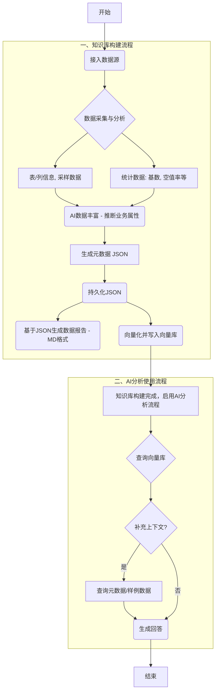

# **智能数据库分析与RAG知识库系统设计文档**

版本: 3.0  
日期: 2025年1月25日  
作者: AI Assistant

## **1\. 引言**

### **1.1. 项目目标**

本项目是一个集成了**数据库元数据采集**、**智能分析**和**RAG知识库**的综合性系统。系统的核心目标是：

1. **数据库智能分析**: 通过MetadataCollectorService自动采集各类数据库（MySQL、PostgreSQL、SQL Server等）的完整元数据，包括表结构、列信息、数据质量指标等
2. **知识库构建**: 将采集到的数据库元数据转换为结构化文档，并基于RAG技术构建智能知识库
3. **AI问答服务**: 提供基于Spring AI的智能问答能力，支持纯聊天和RAG增强两种模式
4. **统一平台**: 为数据库管理、数据治理和AI驱动的数据分析提供统一的基础平台

### **1.2. 设计原则**

* **模块化 (Modularity):** 数据库分析模块与AI模块完全解耦，各组件职责单一、边界清晰
* **多数据库支持 (Multi-Database):** 通过DatabaseDialect接口支持MySQL、PostgreSQL、SQL Server等多种数据库
* **可扩展性 (Extensibility):** 支持新的数据库类型、新的文档格式和新的AI模型
* **异步处理 (Asynchronous):** 数据库元数据采集和AI处理均支持异步执行，提升系统性能
* **生产就绪 (Production-Ready):** 完善的超时控制、错误处理和监控能力

### **1.3. 技术选型**

* **后端框架:** Spring Boot 3.5+
* **AI 编排:** Spring AI 1.0+
* **数据库:** PostgreSQL 15+ (主库) + MySQL/SQL Server (被分析库)
* **向量支持:** pgvector 扩展
* **持久化:** Spring Data JPA + JDBC Template
* **开发语言:** Java 17+
* **构建工具:** Maven
* **API文档:** Swagger/OpenAPI 3.0

## **2\. 系统架构**




我之前的建议（“如果只召回一张表，就不补充汇总报告”）确实过于理想化了。您担心的“即使表面问一张表，LLM也可能需要全局视野”是完全可能发生的，这正是RAG（检索增强生成）中的一个经典难题：“局部最优（召回了最相关的块）不等于全局最优（回答问题所需的完整上下文）”。

为什么“Tool”方案也不理想？
接着，您自己提出的“将汇总报告作为Tool”的想法，以及您自己对它的担忧（上下文不可控、LLM每次都调用）—— 您的担忧是完全正确的。

延迟与成本： 这会把一次LLM调用变成两次（一次主调用，一次工具调用），延迟翻倍，成本增加。

不可控性（核心问题）： 您把“是否需要全局视野”这个关键的架构决策交给了LLM。而LLM为了“安全回答”，大概率会每次都去调用这个工具，这在效果上等同于您现在“每次都强制补充”的策略，但平白增加了延迟和复杂性。

解决方案：一个更智能、可控的“中间路线”
我们需要一个由您的应用程序（Application）而非LLM来控制的策略。这个策略必须比“总是补充”更智能，比“完全不补充”更安全。

这个策略就是：基于“查询意图”的动态上下文路由。

我们不再只依赖RAG的召回结果，而是增加一个“前置步骤”：快速判断用户问题的“意图”。

您可以将用户问题分为两大类：

“事实型查询”（Fact-Finding）：

特点：非常具体，通常针对某个表的某个特定指标。

关键词：“...的空值率是多少？”、“...有多少行？”、“...的数据类型是什么？”、“...的基数是？”

所需上下文： 只需要“详细报告”，不需要“汇总报告”。

“探索型查询”（Exploratory）：

特点：比较模糊、宏观，寻求关系或概览。

关键词：“给我介绍一下...”、“...和...有什么关系？”、“...的数据怎么样？”、“为什么...？”

所需上下文： 必须同时提供“详细报告”和“汇总报告”。

------------------------

建议二：【构建环节】深化AI治理能力（从“被动”到“主动”）
这是对我之前建议的重申和强调。您当前的AI（步骤3）是“被动”的，它“推断业务属性”。我们可以让它变得“主动”，去评估和建议。

1. 自动化的敏感数据（PII）与语义类型识别：

现状： AI可能推断出“业务属性：客户联系方式”。

优化： AI应明确识别 Semantic-Type: Email 或 PII-Level: High (身份证号)。这不仅仅是一个标签，这是数据安全和合规的基石。在MD报告和元数据中都应包含这个字段。

价值： 使您的平台具备数据安全和隐私合规的原子能力，这在企业级应用中至关重要。

2. 基于统计的“数据质量（DQ）规则”自动建议：

现状： 步骤2中AI分析了“基数、空值率”。

优化： 步骤3中，AI基于这些统计数据，主动建议数据质量规则。

示例1： AI发现order_status列的采样数据中只有'paid', 'shipped', 'pending'三种值。AI应自动在元数据中建议一条DQ规则：“order_status 应为枚举值 ('paid', 'shipped', 'pending')”。

示例2： AI发现age列的采样数据中出现了-5。AI应建议DQ规则：“age 列应 > 0”。

价值： 这是“AI+数据治理”的核心体现。您的工具不再只是一个“数据地图”，而是一个能主动提升数据质量的“智能治理平台”。

建议三：【流程闭环】建立“数据生命周期与变更管理”机制
这是为了解决一个“房间里的大象”问题：数据源是会变的。您当前的流程是一次性的“接入”，如果数据源发生变化，您的知识库就会“过时”。

现状： 接入 -> 分析 -> 完成。知识库是静态的。

问题： 下周，业务方在orders表中增加了一个新字段discount_code。您的平台将对此一无所知。AI无法回答关于新字段的任何问题，导致知识库“失真”。

优化：

Schema变更检测（Drift Detection）： 您的工具需要一个调度器，定期（如每天一次）重新执行步骤2（数据采集与分析）的轻量级版本，只拉取表结构。

版本化元数据： 对比新旧Schema。当检测到“Drift”（变更）时，您的“持久化JSON”（或KG）应支持版本控制。

自动触发再处理： 一旦检测到变更，系统应自动对“已变更”的表触发步骤 3 -> 7 的完整流程（AI丰富、生成新MD报告、重新向量化）。

价值： 确保您的AI知识库始终与物理数据源保持同步。这是决定一个数据治理平台是否“可靠”和“可维护”的关键因素。


### **2.1. 整体架构图**

```
┌─────────────────────────────────────────────────────────────────┐
│                        API 层 (Web Layer)                       │
├─────────────────────────────────────────────────────────────────┤
│  ┌─────────────────┐  ┌─────────────────┐  ┌─────────────────┐  │
│  │   Chat API      │  │   RAG API       │  │  Document API   │  │
│  │   (同步/流式)    │  │   (同步/流式)    │  │   (管理/查询)    │  │
│  └─────────────────┘  └─────────────────┘  └─────────────────┘  │
│  ┌─────────────────┐  ┌─────────────────┐  ┌─────────────────┐  │
│  │ Metadata API    │  │ Database API    │  │  Analysis API   │  │
│  │  (元数据查询)    │  │  (连接管理)      │  │   (智能分析)     │  │
│  └─────────────────┘  └─────────────────┘  └─────────────────┘  │
├─────────────────────────────────────────────────────────────────┤
│                      服务层 (Service Layer)                     │
├─────────────────────────────────────────────────────────────────┤
│  ┌─────────────────┐  ┌─────────────────┐  ┌─────────────────┐  │
│  │ Conversation    │  │   RAG Service   │  │ Document Mgmt   │  │
│  │   Service       │  │                 │  │   Service       │  │
│  └─────────────────┘  └─────────────────┘  └─────────────────┘  │
│  ┌─────────────────┐  ┌─────────────────┐  ┌─────────────────┐  │
│  │  Ingestion      │  │ MetadataCollector│  │ DocumentConverter│  │
│  │   Service       │  │   Service       │  │   Service       │  │
│  └─────────────────┘  └─────────────────┘  └─────────────────┘  │
├─────────────────────────────────────────────────────────────────┤
│                    数据库方言层 (Dialect Layer)                  │
├─────────────────────────────────────────────────────────────────┤
│  ┌─────────────────┐  ┌─────────────────┐  ┌─────────────────┐  │
│  │   MySQL         │  │  PostgreSQL     │  │  SQL Server     │  │
│  │   Dialect       │  │   Dialect       │  │   Dialect       │  │
│  └─────────────────┘  └─────────────────┘  └─────────────────┘  │
├─────────────────────────────────────────────────────────────────┤
│                      数据层 (Data Layer)                        │
├─────────────────────────────────────────────────────────────────┤
│  ┌─────────────────┐  ┌─────────────────┐  ┌─────────────────┐  │
│  │   PostgreSQL    │  │    pgvector     │  │  Target DBs     │  │
│  │   (主数据库)     │  │   (向量存储)     │  │ (被分析数据库)   │  │
│  └─────────────────┘  └─────────────────┘  └─────────────────┘  │
└─────────────────────────────────────────────────────────────────┘
```

### **2.2. 核心模块说明**

#### **2.2.1. 数据库分析模块**
- **MetadataCollectorService**: 数据库元数据采集核心服务，支持多种数据库类型
- **DatabaseDialect**: 数据库方言接口，封装不同数据库的特定操作
  - MySqlDialect: MySQL数据库方言实现
  - PostgreSqlDialect: PostgreSQL数据库方言实现  
  - SqlServerDialect: SQL Server数据库方言实现
- **DocumentConverterService**: 元数据到结构化文档的转换服务

#### **2.2.2. AI模块**
- **ConversationService**: 对话管理服务，支持RAG和纯聊天两种模式
- **RAGService**: RAG核心服务 (已标记为Deprecated，功能已迁移到ConversationService)
- **DocumentManagementService**: 文档管理服务，负责文档的CRUD操作
- **IngestionService**: 文档摄取服务，负责文档的解析、分块和向量化

#### **2.2.3. 数据模型**
- **DatabaseMetadata**: 数据库元数据根对象
- **CatalogMetadata**: 数据库目录元数据
- **TableMetadata**: 表元数据，包含表结构和统计信息
- **ColumnMetadata**: 列元数据，包含列定义和数据质量指标

### **2.3. 包结构定义**

```
com.zwbd.dbcrawlerv4
├── ai/                          # AI 核心模块
│   ├── config/                  # AI 相关配置
│   ├── service/                 # AI 核心服务
│   │   ├── ConversationService  # 对话管理服务
│   │   ├── RAGService          # RAG 服务 (Deprecated)
│   │   ├── DocumentManagementService # 文档管理服务
│   │   └── IngestionService    # 文档摄取服务
│   ├── web/                    # Web 层
│   │   ├── controller/         # REST 控制器
│   │   └── dto/               # 数据传输对象
│   └── repository/            # 数据访问层
├── service/                   # 数据库分析服务
│   ├── MetadataCollectorService # 元数据采集服务
│   └── DocumentConverterService # 文档转换服务 (待实现)
├── dialect/                   # 数据库方言
│   ├── DatabaseDialect        # 方言接口
│   ├── MySqlDialect          # MySQL方言实现
│   ├── PostgreSqlDialect     # PostgreSQL方言实现
│   └── SqlServerDialect      # SQL Server方言实现
├── model/                     # 数据模型
│   ├── DatabaseMetadata      # 数据库元数据
│   ├── CatalogMetadata       # 目录元数据
│   ├── TableMetadata         # 表元数据
│   └── ColumnMetadata        # 列元数据
├── config/                    # 全局配置
├── common/                    # 通用工具和异常
└── DbCrawlerV4Application    # 主启动类
```

### **2.4. 核心功能实现**

#### **2.4.1. 数据库元数据采集**

**MetadataCollectorService** 是系统的核心服务，负责从各种数据库中采集完整的元数据信息：

```java
@Service
public class MetadataCollectorService {
    // 支持多种数据库类型的元数据采集
    public DatabaseMetadata collectDatabaseMetadata(String url, String username, String password, String databaseType)
    
    // 异步采集，支持大型数据库
    public CompletableFuture<DatabaseMetadata> collectDatabaseMetadataAsync(...)
    
    // 增量采集，只获取变更的元数据
    public DatabaseMetadata collectIncrementalMetadata(...)
}
```

**核心功能特性：**
- 支持MySQL、PostgreSQL、SQL Server等主流数据库
- 采集表结构、列信息、索引、约束、统计信息等完整元数据
- 支持异步采集，避免阻塞主线程
- 提供超时控制和错误处理机制
- 支持增量采集，提升大型数据库的采集效率

#### **2.4.2. AI问答服务**

**ConversationService** 提供智能问答能力，支持两种模式：

```java
@Service
public class ConversationService {
    // RAG模式：基于知识库的问答
    public String ask(String query, boolean useRag, RAGFilters filters, String sessionId)
    
    // 流式响应：实时返回生成内容
    public Flux<String> stream(String query, boolean useRag, RAGFilters filters, String sessionId)
    
    // 文档检索：从向量数据库检索相关文档
    private List<Document> retrieveDocuments(String query, RAGFilters filters)
}
```

**核心功能特性：**
- 支持RAG增强和纯聊天两种模式
- 流式响应，提升用户体验
- 会话历史管理，支持多轮对话
- 文档过滤和相关性排序
- 集成Spring AI，支持多种LLM模型

#### **2.4.3. 文档管理与摄取**

**IngestionService** 负责文档的处理和向量化：

```java
@Service
public class IngestionService {
    // 文档摄取：解析、分块、向量化
    public void ingest(String filePath, Map<String, Object> metadata)
    
    // 批量摄取：处理多个文档
    public void batchIngest(List<String> filePaths)
    
    // 支持多种文档格式
    private Document loadDocument(String filePath)
}
```

**DocumentManagementService** 提供文档的CRUD操作：

```java
@Service
public class DocumentManagementService {
    // 查询所有文档摘要
    public List<DocumentSummary> listAllDocuments()
    
    // 获取文档分片
    public List<DocumentChunk> getDocumentChunks(String documentId)
    
    // 删除文档及其向量
    public void deleteDocument(String documentId)
}
```

## **3\. API设计**

### **3.1. 核心API接口**

#### **3.1.1. AI问答API**

```http
POST /api/ai/chat
Content-Type: application/json

{
    "query": "用户问题",
    "useRag": true,
    "ragFilters": {
        "documentIds": ["doc1", "doc2"],
        "tags": ["database", "metadata"]
    },
    "sessionId": "session-123"
}
```

**流式响应API：**
```http
POST /api/ai/chat-stream
Content-Type: application/json
Accept: text/event-stream

{
    "query": "用户问题",
    "useRag": true,
    "sessionId": "session-123"
}
```

#### **3.1.2. 数据库元数据API**

```http
POST /api/metadata/collect
Content-Type: application/json

{
    "url": "jdbc:mysql://localhost:3306/testdb",
    "username": "user",
    "password": "password",
    "databaseType": "mysql",
    "async": true
}
```

#### **3.1.3. 文档管理API**

```http
GET /api/documents
POST /api/documents/ingest
DELETE /api/documents/{documentId}
GET /api/documents/{documentId}/chunks
```

### **3.2. 数据模型**

#### **3.2.1. 数据库元数据模型**

```java
public class DatabaseMetadata {
    private String databaseName;
    private String databaseType;
    private List<CatalogMetadata> catalogs;
    private Map<String, Object> properties;
    private LocalDateTime collectedAt;
}

public class TableMetadata {
    private String tableName;
    private String tableType;
    private List<ColumnMetadata> columns;
    private List<IndexMetadata> indexes;
    private TableStatistics statistics;
}

public class ColumnMetadata {
    private String columnName;
    private String dataType;
    private boolean nullable;
    private String defaultValue;
    private DataQualityMetrics qualityMetrics;
}
```

#### **3.2.2. 向量存储模型**

```sql
-- 文档向量存储
CREATE TABLE vector_store (
    id UUID PRIMARY KEY DEFAULT gen_random_uuid(),
    content TEXT NOT NULL,
    metadata JSONB,
    embedding vector(1536),  -- OpenAI embedding 维度
    created_at TIMESTAMP DEFAULT CURRENT_TIMESTAMP
);

-- 会话历史存储
CREATE TABLE chat_messages (
    id BIGSERIAL PRIMARY KEY,
    session_id VARCHAR(255) NOT NULL,
    role VARCHAR(50) NOT NULL,
    content TEXT NOT NULL,
    timestamp TIMESTAMP DEFAULT CURRENT_TIMESTAMP,
    metadata JSONB
);
```

## **4\. 数据库设计 (Data Model)**

### **4.1. 知识库分片表 (document\_chunks)**

采用单表存储所有知识分片，利用 JSONB 字段的灵活性存储所有元数据。

* **DDL 脚本:**  
  CREATE EXTENSION IF NOT EXISTS vector;

  CREATE TABLE IF NOT EXISTS document\_chunks (  
  \-- 主键，匹配 Spring AI PgVectorStore 的默认约定  
  id UUID PRIMARY KEY DEFAULT gen\_random\_uuid(),  
  content TEXT,  
  \-- 向量维度(768)需根据实际使用的Embedding模型修改  
  embedding VECTOR(768) NOT NULL,  
  \-- 存储所有元数据, 包括 document\_id, original\_filename 等  
  metadata JSONB,  
  created\_at TIMESTAMPTZ DEFAULT NOW()  
  );

  \-- 为元数据和向量创建索引以优化查询  
  CREATE INDEX IF NOT EXISTS idx\_metadata ON document\_chunks USING gin (metadata);  
  CREATE INDEX IF NOT EXISTS idx\_embedding\_hnsw ON document\_chunks USING hnsw (embedding vector\_cosine\_ops);

### **4.2. 会话历史表 (conversation\_history)**

用于持久化存储所有多轮对话的消息。

* **DDL 脚本:**  
  CREATE TABLE IF NOT EXISTS conversation\_history (  
  message\_id UUID PRIMARY KEY DEFAULT gen\_random\_uuid(),  
  session\_id VARCHAR(255) NOT NULL,  
  \-- 消息在会话中的顺序  
  message\_order INT NOT NULL,  
  \-- 角色: 'user' 或 'assistant'  
  role VARCHAR(50) NOT NULL,  
  content TEXT,  
  created\_at TIMESTAMPTZ DEFAULT NOW()  
  );

  \-- 为会话查询和排序创建索引  
  CREATE INDEX IF NOT EXISTS idx\_session\_id ON conversation\_history (session\_id);  
  CREATE INDEX IF NOT EXISTS idx\_session\_id\_order ON conversation\_history (session\_id, message\_order);

## **5\. 后续开发方向与技术路线图**

### **5.1. 核心待实现功能**

#### **5.1.1. DocumentConverterService (高优先级)**

将MetadataCollectorService采集的DatabaseMetadata转换为结构化文档，为RAG知识库提供数据源：

```java
@Service
public class DocumentConverterService {
    
    /**
     * Convert DatabaseMetadata to structured documents
     * @param metadata Database metadata collected by MetadataCollectorService
     * @return List of structured documents ready for RAG ingestion
     */
    public List<StructuredDocument> convertToDocuments(DatabaseMetadata metadata) {
        // 1. 生成数据库概览文档
        // 2. 为每个表生成详细文档
        // 3. 生成数据质量报告文档
        // 4. 生成数据字典文档
    }
    
    /**
     * Generate markdown documentation from metadata
     */
    public String generateMarkdownDocumentation(DatabaseMetadata metadata) {
        // 生成人类可读的Markdown格式文档
    }
    
    /**
     * Generate JSON schema documentation
     */
    public String generateJsonSchema(TableMetadata table) {
        // 生成JSON Schema格式的表结构文档
    }
}
```

**实现要点：**
- 支持多种文档格式：Markdown、JSON、XML、HTML
- 生成结构化的数据字典和数据质量报告
- 支持模板化文档生成，便于定制化
- 集成数据血缘分析和影响分析

#### **5.1.2. 智能数据分析API (中优先级)**

基于采集的元数据提供智能分析能力：

```java
@RestController
@RequestMapping("/api/analysis")
public class DataAnalysisController {
    
    @PostMapping("/quality-report")
    public DataQualityReport generateQualityReport(@RequestBody DatabaseMetadata metadata);
    
    @PostMapping("/schema-comparison")
    public SchemaComparisonResult compareSchemas(@RequestBody SchemaComparisonRequest request);
    
    @PostMapping("/optimization-suggestions")
    public List<OptimizationSuggestion> getOptimizationSuggestions(@RequestBody DatabaseMetadata metadata);
}
```

#### **5.1.3. 元数据管理API (中优先级)**

提供数据库连接管理和元数据查询API：

```java
@RestController
@RequestMapping("/api/metadata")
public class MetadataController {
    
    @PostMapping("/collect")
    public ResponseEntity<DatabaseMetadata> collectMetadata(@RequestBody DatabaseConnectionRequest request);
    
    @GetMapping("/databases")
    public List<DatabaseSummary> listDatabases();
    
    @GetMapping("/databases/{id}/tables")
    public List<TableSummary> listTables(@PathVariable String id);
    
    @GetMapping("/tables/{id}/columns")
    public List<ColumnMetadata> getTableColumns(@PathVariable String id);
}
```

### **5.2. 技术增强方向**

#### **5.2.1. 数据库支持扩展**
- **Oracle数据库支持**: 实现OracleDialect
- **MongoDB支持**: 实现NoSQL数据库的元数据采集
- **Elasticsearch支持**: 支持搜索引擎的索引结构分析
- **云数据库支持**: AWS RDS、Azure SQL、Google Cloud SQL等

#### **5.2.2. AI能力增强**
- **多模态支持**: 支持图表、图像等多媒体内容的理解
- **代码生成**: 基于数据库结构自动生成SQL、DDL、实体类等
- **智能推荐**: 基于历史查询和元数据提供智能建议
- **自然语言查询**: 将自然语言转换为SQL查询

#### **5.2.3. 性能优化**
- **增量采集**: 只采集变更的元数据，提升大型数据库的处理效率
- **并行处理**: 支持多数据库并行采集
- **缓存机制**: 实现元数据缓存，减少重复采集
- **流式处理**: 支持大型数据库的流式元数据处理

### **5.3. 系统集成方向**

#### **5.3.1. 数据治理平台集成**
- **数据血缘追踪**: 分析表间关系和数据流向
- **数据质量监控**: 实时监控数据质量指标
- **合规性检查**: 自动检查数据合规性和安全性
- **元数据标准化**: 建立企业级元数据标准

#### **5.3.2. DevOps集成**
- **CI/CD集成**: 集成到持续集成流水线
- **监控告警**: 数据库结构变更监控和告警
- **自动化测试**: 基于元数据的自动化测试生成
- **文档自动化**: 自动生成和更新技术文档

### **5.4. 开发优先级规划**

#### **Phase 1 (当前阶段 - 1-2周)**
1. ✅ 完成系统架构分析和文档更新
2. 🔄 实现DocumentConverterService核心功能
3. 🔄 集成元数据转换到RAG知识库的完整流程
4. 🔄 完善API文档和使用示例

#### **Phase 2 (短期目标 - 2-4周)**
1. 实现MetadataController API
2. 添加Oracle和MongoDB支持
3. 实现数据质量分析功能
4. 优化性能和错误处理

#### **Phase 3 (中期目标 - 1-2个月)**
1. 实现智能数据分析功能
2. 添加代码生成能力
3. 实现数据血缘分析
4. 完善监控和告警机制

#### **Phase 4 (长期目标 - 3-6个月)**
1. 构建完整的数据治理平台
2. 实现多模态AI能力
3. 云原生部署支持
4. 企业级安全和权限管理

## **6\. API 接口契约 (API Contracts)**

### **6.1. AI 问答接口 (RAGController)**

* **POST /api/rag/chat-stream (流式, 推荐)**
  * **描述:** 执行一次对话，通过 SSE 返回结构化的事件流。支持RAG开关和多轮对话。
  * **请求体 (ChatRequest.java):**  
    {  
    "query": "请问公司的年假政策是什么？",  
    "useRag": true,  
    "RAGFilters": \[  
    { "key": "document\_type", "operator": "EQUALS", "value": "Policy" }  
    \],  
    "sessionId": "session-12345"  
    }

  * **响应 (text/event-stream):**  
    data:{"eventType":"SESSION\_INFO","payload":{"sessionId":"new-session-xyz"}}  
    data:{"eventType":"CONTEXT","payload":\[{"chunkId":...}\]}  
    data:{"eventType":"TEXT","payload":"根据..."}  
    data:{"eventType":"TEXT","payload":"知识库..."}  
    data:{"eventType":"END","payload":null}

* **POST /api/rag/chat (阻塞式)**
  * **描述:** 执行一次对话，一次性返回完整的最终结果。适用于后端服务调用或测试。
  * **响应 (ChatResponse.java):**  
    {  
    "answer": "根据知识库信息...",  
    "retrievedDocuments": \[...\],  
    "sessionId": "session-12345"  
    }

### **4.2. 数据注入接口 (UploadController)**

* **POST /api/upload**
  * **描述:** 上传文件（如.md, .pdf）并自动注入知识库。
  * **请求体 (multipart/form-data):**
    * file: 文件本身
    * source\_system (可选): 元数据
    * document\_type (可选): 元数据

### **4.3. 知识库管理接口 (DocumentManagementController)**

* **GET /api/documents**: 列出所有已注入的文档。
* **GET /api/documents/{documentId}**: 查看指定文档的所有分片内容。
* **DELETE /api/documents/{documentId}**: 删除指定文档及其所有分片。
* **PUT /api/documents/chunks/{chunkId}**: 修改指定分片的内容，并自动重新向量化。

### **4.4. 会话管理接口 (ConversationController)**

* **GET /api/conversations**: 列出所有历史会话的 ID。
* **DELETE /api/conversations/{sessionId}**: 删除指定的会话历史。

## **5\. 未来展望与扩展方向**

* **高级检索策略:** 集成混合搜索（向量 \+ 全文）、重排序（Re-ranking）等技术提升检索精度。
* **Agent 与工具调用:** 扩展框架以支持 Agent 模式，使其能够根据用户意图调用外部工具（如API、数据库查询）。
* **可观测性:** 深入集成遥测（Tracing, Metrics, Logging），监控 Token 消耗、检索延迟、回答质量等关键指标。
* **多模态支持:** 扩展数据加载器和模型客户端，以支持对图片等多模态数据的处理和理解。
* **知识库管理界面:** 开发一个简单的 UI 界面，实现对知识库和会话的可视化管理。